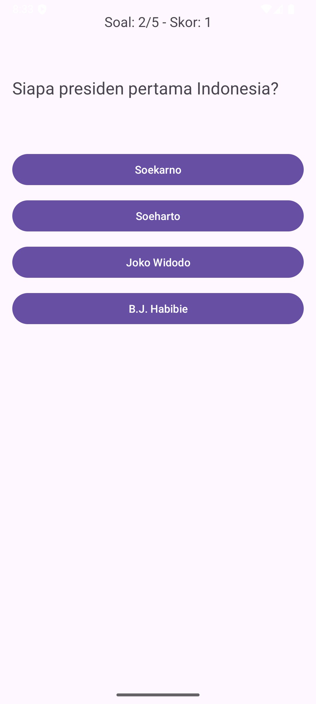

# Loar Lieur - Aplikasi Kuis Sederhana

## Deskripsi Proyek

**Loar Lieur** adalah aplikasi kuis interaktif sederhana berbasis Android yang dirancang untuk menguji pengetahuan pengguna melalui serangkaian pertanyaan pilihan ganda. Aplikasi ini menampilkan pertanyaan satu per satu, pengguna memilih jawaban, dan aplikasi akan menghitung skor di akhir permainan. Proyek ini bertujuan untuk melatih logika pemrograman dasar, penanganan event, manajemen state sederhana, dan navigasi antar layar (Activity) dalam pengembangan aplikasi Android menggunakan Java.

## Fitur Utama

* **Layar Awal:** Tampilan selamat datang dengan judul aplikasi dan tombol untuk memulai kuis.
* **Layar Kuis:**
    * Menampilkan pertanyaan kuis.
    * Menyediakan beberapa pilihan jawaban (menggunakan Button).
    * Menampilkan nomor soal saat ini dan total soal.
    * Menampilkan skor sementara pengguna.
* **Layar Hasil:**
    * Menampilkan skor akhir yang diperoleh pengguna.
    * Menyediakan opsi untuk "Main Lagi" atau "Kembali ke Awal".
* **Data Kuis Statis:** Pertanyaan, pilihan jawaban, dan kunci jawaban disimpan secara statis dalam resource aplikasi (`arrays.xml`).

## Tampilan Aplikasi (Contoh)

**Layar Awal:**
 

**Layar Kuis:**
 

**Layar Hasil:**
 

## Teknologi yang Digunakan

* **Bahasa Pemrograman:** Java
* **Platform:** Android
* **IDE:** Android Studio
* **Komponen UI Android:**
    * `RelativeLayout`, `LinearLayout`
    * `TextView`
    * `Button`
    * `ImageView`
    * `MaterialCardView` (dari Material Components for Android)
* **Manajemen Resource:** `strings.xml` (untuk teks), `arrays.xml` (untuk data kuis), `drawable` (untuk gambar/logo).
* **Navigasi:** `Intent` untuk perpindahan antar `Activity`.

## Cara Menggunakan Aplikasi

1.  Saat aplikasi pertama kali dibuka, Anda akan melihat layar awal dengan judul "Loar Lieur" dan logo.
2.  Tekan tombol "**Mulai Kuis**" untuk memulai.
3.  Di layar kuis, baca pertanyaan yang ditampilkan.
4.  Pilih salah satu jawaban yang menurut Anda benar dengan menekan tombol pilihan yang tersedia.
5.  Aplikasi akan memberitahu apakah jawaban Anda benar atau salah (melalui Toast message) dan otomatis berpindah ke pertanyaan berikutnya.
6.  Skor dan nomor soal akan diperbarui secara otomatis.
7.  Setelah semua pertanyaan terjawab, Anda akan diarahkan ke layar hasil.
8.  Di layar hasil, Anda dapat melihat skor akhir Anda.
9.  Anda memiliki opsi untuk "**Main Lagi**" (mengulang kuis dari awal) atau "**Kembali ke Awal**" (kembali ke layar utama aplikasi).

## Potensi Pengembangan Selanjutnya

* Menambahkan variasi jenis pertanyaan (misalnya, benar/salah, isian singkat).
* Mengacak urutan pertanyaan dan pilihan jawaban.
* Menambahkan timer untuk setiap pertanyaan atau untuk keseluruhan kuis.
* Menyimpan skor tertinggi (High Score).
* Mengambil data kuis dari database lokal (SQLite) atau API eksternal.
* Kustomisasi tema dan tampilan yang lebih menarik.
* Menambahkan kategori kuis.

## Kontribusi

Jika Anda ingin berkontribusi pada proyek ini, silakan lakukan fork repository dan buat pull request. Saran dan masukan sangat dihargai!

---
